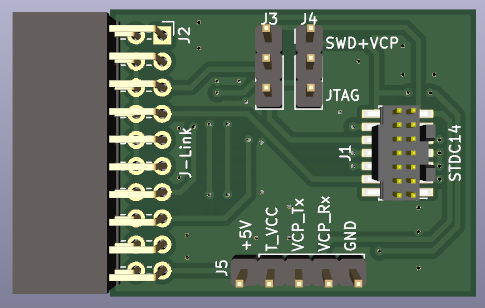
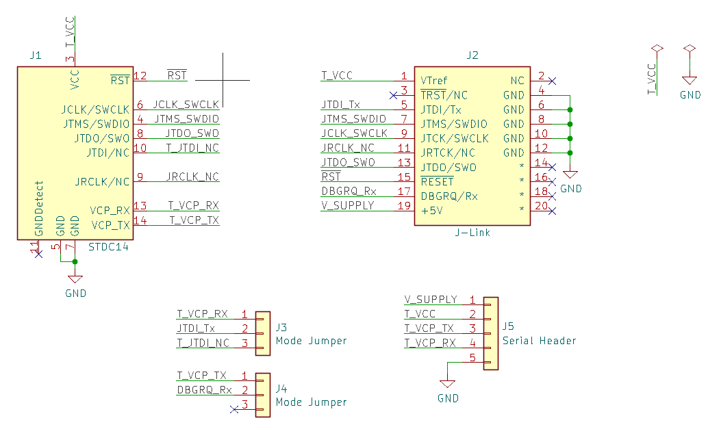

# J-Link to STDC14 Adapter Board

This repository contains the [KiCad](http://kicad.org/) project
with the complete circuit schematics and PCB layout for an adapter
board used to connect cables designed for the STDC14 connector from
the [ST-Link v3](https://www.st.com/en/development-tools/stlink-v3set.html)
programmer to the port on a [Segger J-Link](https://www.segger.com/products/debug-probes/j-link/)
programmer.

Since the J-Link pinouts for SWD and JTAG modes are not directly
compatible, jumpers have been added for switching between them.
Also, since the J-Link's Virtual COM Port feature does not work
with JTAG mode, it has also been brought out to a pin header
so it can be connected to a serial adapter if desired.

